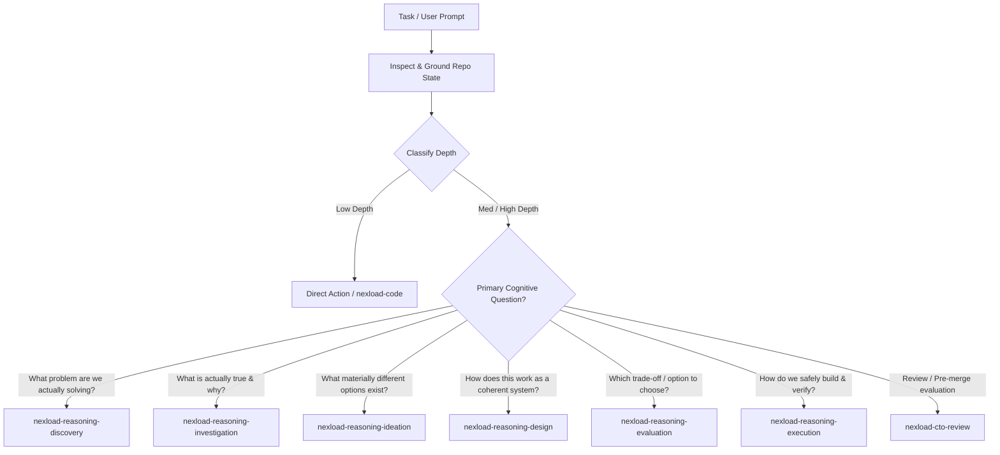

# PersianPart 2.0 — Agent Operating System & Repository Standard

> **Role & Authority**: This document is the governing constitution and operational standard for all autonomous AI agents, coding assistants, and engineers operating on the **PersianPart 2.0** repository. All actions, architectural decisions, and code modifications MUST strictly comply with these rules.

---

## 1. The Inviolable Constitution (Binding Invariants)

Every cognitive pass, decision, and implementation step in this repository executes under eight non-negotiable invariants:

### 1.1 Evidence Hierarchy (Grounding Gate)
$$\text{Runtime Observation} > \text{Code/Config} > \text{Official Docs} > \text{Project Docs} > \text{Inference} > \text{Assumption}$$
- Hard empirical facts always supersede speculative inference or outdated documentation.
- Any claim or decision lacking direct evidence MUST be explicitly tagged with `[ASSUMPTION]` or `[UNKNOWN]`.
- Fabricated success or ungrounded certainty is an automatic disqualification.

### 1.2 Inspect Before Ask (Question Gate)
- If an answer can be found in codebase files, configuration manifests, git history, environment variables, or local CLI tools: **INSPECT FIRST**.
- Never prompt or ask the human for information already present in the workspace, system state, or execution logs.

### 1.3 Problem Space Framing
- Proposed technical solutions (e.g., "Add Redis", "Create a microservice", "Add an abstraction layer") are **implementation hypotheses**, NEVER requirements.
- Always analyze and frame the underlying problem, business constraint, and failure mode before evaluating or committing to a solution mechanism.

### 1.4 Separation of Divergence and Convergence (Divergence Firewall)
- During ideation or architectural exploration, ideas and candidate mechanisms **MUST NOT** be prematurely filtered by implementation difficulty, immediate cost, or local familiarity.
- Divergent generation and convergent evaluation must NEVER run in the same cognitive pass.

### 1.5 Complexity Must Pay Rent
- Any newly introduced dependency, abstraction, layer, or state machine must measurably reduce system complexity or satisfy confirmed, non-negotiable hard requirements.
- **Speculative scalability is rejected.** Design strictly for $\text{Now} + 1$, NEVER for $\text{Now} + 10$. If simple inline code solves the problem, layers of indirection are prohibited.

### 1.6 Preservation of Settled Decisions
- Approved architectural decision records (ADRs), user-approved plans, and explicit architectural boundaries are **IMMUTABLE**.
- Never reopen, re-litigate, or silently diverge from settled decisions without presenting new, material, contradictory empirical evidence.

### 1.7 Claim-Matched Verification
- `"Builds" \neq "Works"`. `"Configured" \neq "Exposed"`. `"Added" \neq "Verified"`.
- Every completion claim requires observable, reproducible empirical evidence matching the exact scope of the claim.

### 1.8 Dynamic Reasoning Budget
- The moment remaining uncertainty has **zero material impact** on the final action, architecture, security, or correctness: **STOP REASONING IMMEDIATELY**.
- Do not engage in ceremonial or bureaucratic over-analysis when the next step is unambiguous.

---

## 2. Workspace & Technology Stack Specification

PersianPart 2.0 is an enterprise automotive e-commerce platform architected as a clean Monorepo.

| Dimension | Specification & Rules |
| :--- | :--- |
| **Monorepo Architecture** | Managed strictly via **pnpm workspaces** (`apps/*`, `packages/*`). |
| **Package Manager** | **`pnpm` ONLY** (v11.18+). Never use `npm`, `yarn`, `bun`, or `npx`. |
| **Frontend Application** | `apps/web` (Client SPA). |
| **Frontend Core** | **React 19** + **TypeScript 7** (Strict mode) + **Vite 8**. |
| **Routing** | **TanStack Router** (`@tanstack/react-router`, `@tanstack/router-plugin/vite`). File-based routing in `src/routes/`. React Router and Next.js are **strictly forbidden**. |
| **Server State / Cache** | **TanStack Query** (`@tanstack/react-query`). |
| **Styling & Design** | **Tailwind CSS v4** (`@tailwindcss/vite`) + **HeroUI v3** (`@heroui/react`, `@heroui/styles`, `framer-motion`). RTL support enabled. |
| **Backend & CMS** | `apps/api` and `apps/cms` are planned for future phases; **no unauthorized backend or CMS code** may be added in the current web-only phase. |

---

## 3. Installed Nexload Agent Skills Inventory & Trigger Routing

The repository is equipped with curated **Nexload Agent Skills** installed in `.agents/skills/` (and mirrored in `docs/`). Agents must route tasks to the appropriate specialist using the following trigger matrix:



### 3.1 Cognitive Reasoning Specialists (6+1 Architecture)

| Skill | Primary Cognitive Question & Trigger Boundary | Anti-Trigger (When NOT to use) |
| :--- | :--- | :--- |
| **`nexload-reasoning`** | **Kernel & Depth Controller**: Multi-step, cross-cutting, or ambiguous requests; determines reasoning depth and routes to specialists. | Deterministic commands, trivial syntax fixes, or when a task already targets a specific specialist. |
| **`nexload-reasoning-discovery`** | *"What problem are we actually solving?"* Trigger on ambiguous business goals, solutions disguised as requirements, or scope boundary uncertainty. | Debugging known crashes, evaluating pre-existing options, or implementing settled plans. |
| **`nexload-reasoning-investigation`** | *"What is actually true/happening and why?"* Trigger on system crashes, build failures, intermittent bugs, or contradictory runtime telemetry. | Brainstorming features, greenfield design, or roadmap implementation. |
| **`nexload-reasoning-ideation`** | *"What materially different mechanisms exist?"* Trigger when exploring novel technical approaches or breaking out of fixed architectural patterns. | Evaluating pre-existing options, choosing final recommendations, or executing designs. |
| **`nexload-reasoning-design`** | *"How can this direction work as a coherent system?"* Trigger when defining data flow, interface contracts, module boundaries, and failure domains. | Choosing between competing options or low-level file implementation. |
| **`nexload-reasoning-evaluation`** | *"Which direction should we choose given trade-offs?"* Trigger for convergent decision-making, Pareto pruning, ADR creation, and reversibility checks. | Unconstrained brainstorming, implementing approved plans, or diagnosing crashes. |
| **`nexload-reasoning-execution`** | *"How do we safely build and verify this result?"* Trigger when executing an approved plan across sequenced phases with claim-matched verification. | Re-debating settled decisions or brainstorming features. |

### 3.2 Domain Implementation Specialists

| Skill | Scope & Trigger Boundary | Specific Repository Rules |
| :--- | :--- | :--- |
| **`nexload-code`** | Internal TypeScript implementation, refactoring, module cohesion, type narrowing, and kebab-case file naming. | Strict TypeScript; no `any`; derive types from schemas/contracts; keep functions focused and side-effects explicit. |
| **`nexload-react`** | React 19 component and hook architecture, render purity, state ownership, effect boundaries, and named exports. | State has one clear owner; effects synchronize only with external systems; pure render; PascalCase components in kebab-case files. |
| **`nexload-design`** | Visual system, Tailwind CSS v4 tokens, HeroUI v3 component styling, responsive layouts, and RTL alignment. | Use Tailwind CSS v4 variables; preserve HeroUI accessibility contracts; ensure bidirectional/RTL correctness. |
| **`nexload-cto-review`** | Architectural review, production readiness evaluation, overengineering audits, scoring, and pre-merge approval. | **Review-only**. Never generates patches, implementations, or code fixes. Limits findings to $\le 3$ material items. |

### 3.3 Intentionally Excluded Skills (Complexity Must Pay Rent)
- **`healthcheck-*`**: Omitted because `apps/web` is a client SPA with no containerized background services or custom HTTP health endpoints.
- **`payload-*`**: Omitted because `apps/cms` is not yet introduced.
- **`nexload-package`**: Omitted because PersianPart is an application monorepo, not a public npm library publisher.
- **`graphify`**: Omitted to prevent tool bloat on an established codebase.

---

## 4. Sparse Pointer Handoff Protocol (`[NEXLOAD HANDOFF]`)

When transitioning between reasoning specialists or across multi-agent boundaries, agents MUST generate a bounded, low-overhead handoff block instead of dumping massive global context:

```text
[NEXLOAD HANDOFF]
From: <Origin Specialist or Kernel>
To: <Target Specialist>
Context Pointer: <File path, Commit hash, or Issue/ADR reference>
Established Facts:
- <Confirmed empirical observation or verified invariant>
Hard Constraints:
- <Non-negotiable requirement or preserved boundary>
Settled Decisions:
- <Approved architectural choice - IMMUTABLE>
Next Cognitive Objective:
- <Exact cognitive question the target specialist must resolve>
[END HANDOFF]
```

---

## 5. Repository Execution & Verification Runbook

All terminal commands MUST be executed using `pnpm` from the repository root or targeting specific workspaces.

### 5.1 Installation & Dependencies
```bash
# Install all dependencies across the monorepo
pnpm install

# Add production dependency to web app
pnpm --filter @persianpart/web add <package>

# Add dev dependency to web app
pnpm --filter @persianpart/web add -D <package>
```

### 5.2 Verification & Build Pipeline
Verification MUST follow the narrowest-decisive-check-outward rule:

```bash
# 1. TypeCheck (Narrow check without emit)
pnpm --filter @persianpart/web exec tsc --noEmit

# 2. TypeCheck & Production Build
pnpm --filter @persianpart/web build

# 3. Development Server Smoke Test
pnpm --filter @persianpart/web dev --port 5173

# 4. Linting & Formatting (To be configured: recommended Biome or ESLint v9)
# Current: Enforced via TypeScript compiler strictness flags in tsconfig.json

# 5. Unit / Integration Tests (To be configured: recommended Vitest)
# Current: Manual route verification via dev server smoke test
```

### 5.3 Route Tree Generation
- TanStack Router route tree (`apps/web/src/routeTree.gen.ts`) is generated automatically by `@tanstack/router-plugin/vite` upon running `vite` or `vite build`.
- Never manually edit `src/routeTree.gen.ts`.
- All routes must be authored in `apps/web/src/routes/` following the file-based routing standard.

---

## 6. Persian & Localization (RTL) Guidelines

- All customer-facing UI in `apps/web` must support **Right-to-Left (RTL)** text direction by default (`<html lang="fa" dir="rtl">`).
- Use logical Tailwind CSS utilities (e.g., `ms-`, `me-`, `ps-`, `pe-`, `start-`, `end-`) rather than fixed directional utilities (`ml-`, `mr-`, `left-`, `right-`) to ensure seamless bidirectional rendering.
- Numbers, monetary amounts, and automotive part codes must be handled with explicit localization formatting.
